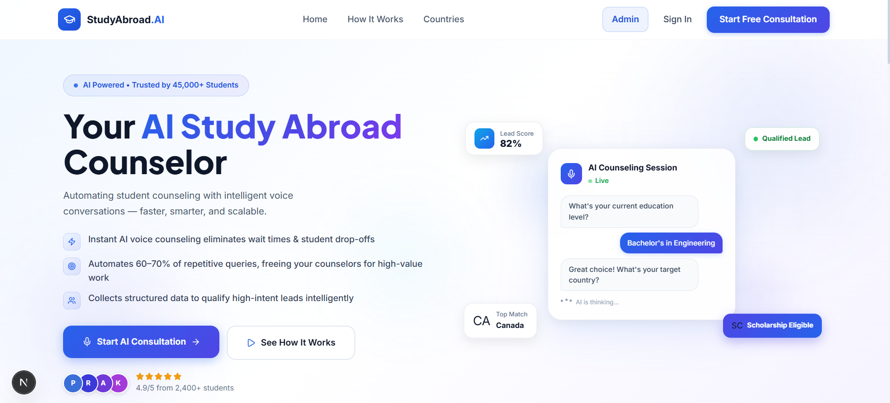
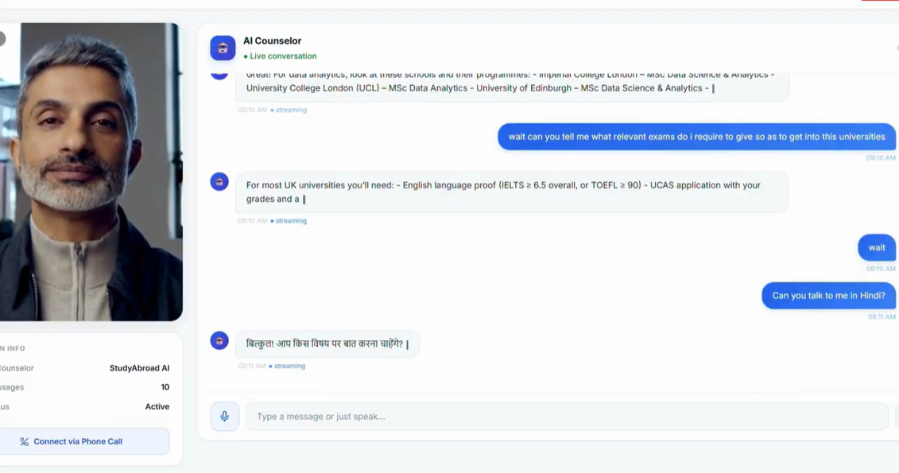

# StudyAbroad.AI

AI-powered Study Abroad counseling platform for students and counselors.

It combines Google auth, smart onboarding, live AI sessions (avatar + call), lead scoring, university recommendations, calendar scheduling, and admin operations on top of Supabase-backed persistent context.

## Product Flow 🧭

🏠 Landing Page -> 🔐 Google Auth (Supabase identity) -> 🧩 Role Routing (User/Admin)

- 👨‍🎓 User journey:
	- First sign-in: onboarding
	- Onboarding voice interaction powered by Vapi
	- Then: personal dashboard
	- Multilingual counseling experience (example: English + Hindi)
	- Schedule counseling sessions via Google Calendar flow
	- Start session in 2 modes:
		- AI Avatar (live visual counselor)
		- AI Calling mode via Twilio (when avatar/device is unavailable)
	- Conversations are stored, analyzed, and converted into reports
	- Session reminders and follow-ups sent via Twilio WhatsApp
	- Follow-up recommendations and next actions visible in dashboard/report views

- 🛠️ Admin journey:
	- Admin dashboard with student prioritization and queues
	- University management panel
	- Calendar visibility for upcoming counseling activities
	- Lead intelligence via metrics, scores, and session context

## Key Features ✨

- 🔐 Google OAuth login and role-aware access
- 🗂️ Supabase-backed user/admin records
- 👋 First-time onboarding detection (`needs_onboarding` flow)
- ☎️ Vapi calling for onboarding and first-contact voice capture
- 🌐 Multilingual conversation support for student counseling
- 🎙️ AI counseling sessions with transcript capture
- 📞 Twilio calling support for live/offline counseling sessions
- 🔔 Twilio WhatsApp reminders for scheduled sessions
- 📊 Lead scoring and Hot/Warm/Cold style classification
- 🏫 University recommendation APIs + dashboard presentation
- 📝 Session report generation with score breakdown and action checklist
- 🧠 RAG endpoint for knowledge-grounded answers
- 💬 WhatsApp summary messaging hooks
- 📈 Dashboard metrics for operational visibility

## Screenshots 🖼️

### Dashboard 📊



### AI Avatar Session 🧑‍💼



## Tech Stack 🧱

- Frontend: Next.js 16, React 19, TypeScript, Tailwind CSS
- Backend: FastAPI + Uvicorn (Python 3.13+)
- Database/Auth: Supabase
- AI/Voice Integrations: Vapi, Anam, Groq, Twilio

## Supabase Data Model (Core) 🗄️

- `students`: student identity/profile
- `academic_profiles`: education + preferences + budget/test context
- `call_sessions`: transcript, recording URL, sentiment, lead score, detailed report
- `meetings`: scheduled counseling sessions
- `universities`: university catalog for recommendations
- `admins`: admin-role identities
- `knowledge_base`: RAG context documents

This allows the system to keep context from previous conversations and use it in future sessions/recommendations.

## Repository Layout 🗂️

```text
frontend/   Next.js app (landing, auth, onboarding, dashboard, session, admin)
backend/    FastAPI API layer (auth, leads, scoring, voice, messaging, reports, RAG)
image/      Project screenshots for documentation
```

## Quick Start 🚀

### 1) Backend ⚙️

```bash
cd backend
python -m venv .venv
.venv\Scripts\activate
pip install -r requirements.txt
uvicorn main:app --reload --host 0.0.0.0 --port 8000
```

### 2) Frontend 💻

```bash
cd frontend
npm install
npm run dev
```

- Frontend: http://localhost:3000
- Backend docs: http://localhost:8000/docs

## Environment Variables 🔑

### Backend (required) ✅

```env
SUPABASE_URL=
SUPABASE_SERVICE_ROLE_KEY=
FRONTEND_ORIGIN=http://localhost:3000
```

### Backend (commonly used) 🧩

```env
GOOGLE_CLIENT_ID=
GOOGLE_CLIENT_SECRET=
GOOGLE_REDIRECT_URI=
SUPABASE_JWT_SECRET=
GROQ_API_KEY=
GROQ_MODEL=
ANAM_API_KEY=
ANAM_AVATAR_ID=
ANAM_PERSONA_ID=
ANAM_VOICE_ID=
ANAM_LLM_ID=
ANAM_SYSTEM_PROMPT=
TWILIO_ACCOUNT_SID=
TWILIO_AUTH_TOKEN=
TWILIO_PHONE_NUMBER=
TWILIO_WHATSAPP_FROM=
TWILIO_WEBHOOK_BASE_URL=
```

### Frontend (`frontend/.env.local`) 🌐

```env
NEXT_PUBLIC_BACKEND_URL=http://localhost:8000
NEXT_PUBLIC_PY_BACKEND_URL=http://localhost:8000
NEXT_PUBLIC_VAPI_PUBLIC_KEY=
NEXT_PUBLIC_VAPI_ASSISTANT_ID=
```

## Core API Surface 🔌

- `GET /health`
- `GET /api/v1/auth/google/login`
- `GET /api/v1/auth/google/callback`
- `GET /api/v1/auth/google/profile`
- `POST /api/v1/students/complete`
- `POST /api/v1/leads`
- `GET /api/v1/leads`
- `PATCH /api/v1/leads/{lead_id}`
- `POST /api/v1/leads/{lead_id}/score`
- `GET /api/v1/leads/{lead_id}/recommendations`
- `POST /api/v1/appointments`
- `GET /api/v1/calendar/events`
- `POST /api/v1/calls/webhook`
- `POST /api/v1/calls/outbound`
- `POST /api/v1/messages/whatsapp/send-summary`
- `POST /api/v1/messages/whatsapp/send-reminder`
- `POST /api/v1/rag/query`
- `GET /api/v1/dashboard/metrics`
- `GET /api/v1/admin/priority-queue`

## Admin-Side Highlights 🧑‍💼

- Priority queue for student follow-ups
- University panel and recommendation context
- Calendar card for meeting visibility
- Student report access
- Operational dashboard metrics for counselor teams

## Why StudyAbroad.AI? 🌍

StudyAbroad.AI is designed as an end-to-end counseling OS: from first contact to final guidance.

- Human-like AI interaction
- Persistent student context across sessions
- Actionable recommendations and scheduling
- Clear visibility for both students and admins
